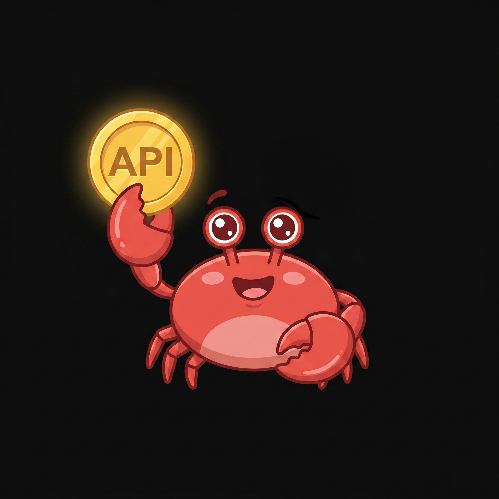

# tokenclaw

<p align="center">
  
</p>

View, alert, and control AI agent spend in real time.

AI agents do not stop when something goes wrong. They keep running, retrying, and silently burning through API budgets.

> "I left an agent running overnight. $280."
>
> "Agent entered an infinite loop. $4,200 in a weekend."
>
> "I set a spending limit. Turns out it was just an email."

<p align="center">
  
</p>

tokenclaw gives you visibility and control over that spend before it becomes a surprise bill.

<p align="center">
  
</p>

## What it does

tokenclaw sits between your agents and model providers and gives you three things:

- **View** spend per API key in real time
- **Alert** when usage crosses thresholds you set
- **Block** requests when limits are exceeded

## Install

<p align="center">
  
</p>

```bash
npm install -g tokenclaw-dev
```

## Quick start

### 1. Scan

```bash
tokenclaw
```

Reads the local session logs that AI tools leave on your machine (`~/.claude/projects/`, `~/.cursor/projects/`, etc.), counts tokens, and estimates cost. Nothing is sent anywhere.

### 2. Set a daily budget

First run asks two questions:

- **Daily spend limit** — alert when total spend crosses this (default: $100/day)
- **Slack webhook URL** — where to send alerts ([create one here](https://api.slack.com/messaging/webhooks))

That's it. Config is saved to `~/.tokenclaw/config.yaml`. Change it anytime with `tokenclaw init`.

### 3. Start monitoring

```bash
tokenclaw watch
```

Re-scans your local session logs every hour. Sends a Slack alert when spend crosses your daily or weekly threshold. Runs in the foreground — add it to cron or run in a background terminal.

This gives you a budget on **total spend across all tools**. If you want budgets and limits **per API key**, keep reading.

---

## Per-key budgets and hard limits

The proxy sits between your agents and the API. It tracks spend per API key and can block requests when a budget is exceeded.

```bash
tokenclaw proxy
```

Point your agent at it:

```bash
ANTHROPIC_BASE_URL=http://localhost:4040 claude
OPENAI_BASE_URL=http://localhost:4040 your-agent
```

Add a block rule:

```bash
tokenclaw set --key sk-ant-research --budget 10/day --warn 80% --block 100%
```

View spend per key:

```bash
tokenclaw keys
```

```
sk-ant-research   $7.20 / $10 (72%)
  warn at 80%
  block at 100%

sk-proj-deploy    $12.50 / $100 (12%)
  warn at 80%
```

## What happens when limits are hit

- **warn** → Slack alert, request passes through
- **block** → 429 returned, request stopped (proxy only)

```json
{
  "error": {
    "type": "budget_exceeded",
    "message": "Key sk-ant-research exceeded daily budget of $10.00 ($10.42 spent)."
  }
}
```

## How it works

<p align="center">
  
</p>

Your agent sends a request. tokenclaw identifies the API key, checks spend against your rules, and either forwards or blocks.

Auto-detects provider from request path:

- `/v1/messages` → Anthropic
- `/v1/chat/completions` → OpenAI (also Groq, Together, Fireworks)

One proxy. Runs on localhost.

## Budget rules

| Flag | What it does |
|---|---|
| `--warn N%` | Send Slack alert at N% of budget |
| `--block N%` | Block requests at N% of budget (proxy only) |
| (no flags) | Default: warn at 80% |

Periods: `day` (midnight UTC), `week` (Monday UTC), `month` (1st UTC).

Keys match on longest prefix. Unregistered keys pass through with no limit.

## Safety

Nothing is blocked unless you configure a `--block` rule and run the proxy. Default is warn-only.

## Config

`~/.tokenclaw/config.yaml`:

```yaml
key_budgets:
  sk-ant-research:
    budget: 10
    period: day
    rules:
      - at: 80
        action: alert
      - at: 100
        action: block
alerts:
  slack_webhook: "https://hooks.slack.com/..."
```

## Commands

```bash
tokenclaw            # scan local AI tools
tokenclaw proxy      # start enforcement proxy
tokenclaw set        # set budget rules
tokenclaw keys       # view spend vs budget
tokenclaw status     # spend + alert status
tokenclaw watch      # continuous monitoring
tokenclaw ack        # silence alerts (24h)
tokenclaw config     # show config
```

## Uninstall

```bash
npm uninstall -g tokenclaw-dev
rm -rf ~/.tokenclaw
```

## License

MIT
