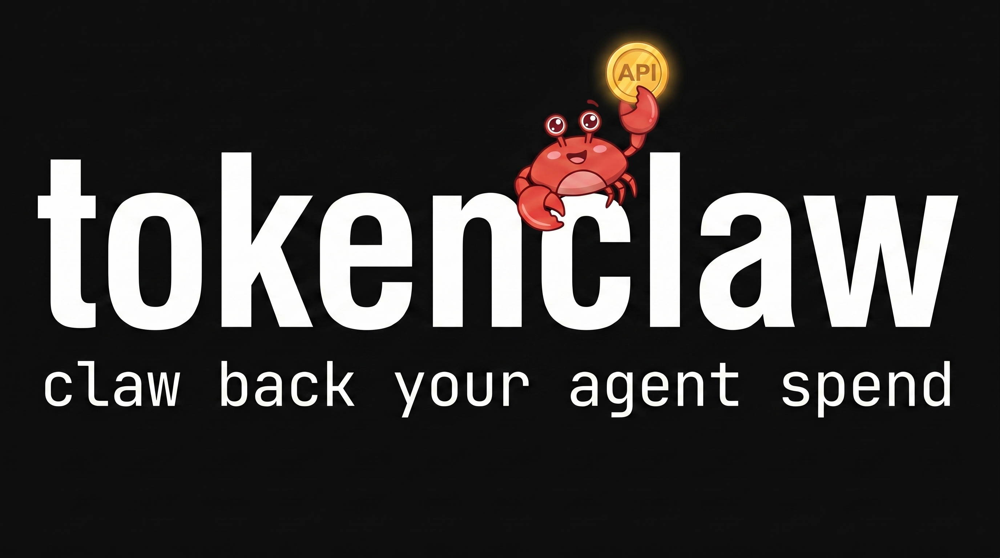
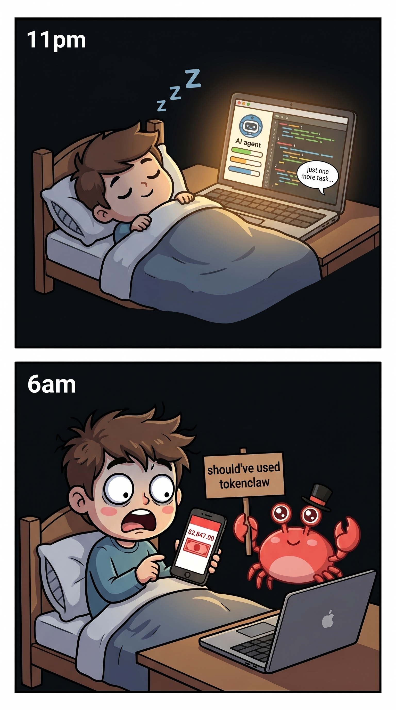
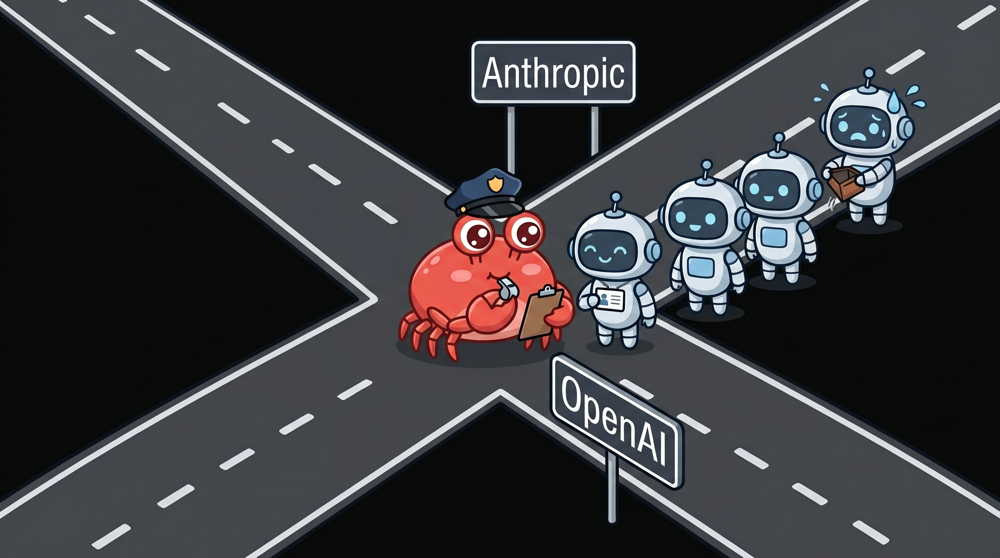

# tokenclaw

<p align="center">
  
</p>

View, alert, and control AI API spend in real time.

AI agents do not stop when something goes wrong. They keep running, retrying, and silently burning through API budgets.

> "I left an agent running overnight. $280."
>
> "Agent entered an infinite loop. $4,200 in a weekend."
>
> "I set a spending limit. Turns out it was just an email."

<p align="center">
  
</p>

tokenclaw tracks your API spend and gives you visibility and control before it becomes a surprise bill.

<p align="center">
  
</p>

## Install

```bash
npm install -g tokenclaw-dev
```

---

## View — see your API spend

```bash
tokenclaw view models             # cost by model
tokenclaw view projects           # cost by project
tokenclaw view trends             # daily spend over time
tokenclaw view usage              # token counts
tokenclaw view efficiency         # cache rates, cost per session
```

Reads session logs stored locally by AI tools, counts tokens, estimates cost at API rates. Only shows API-billed spend (OpenClaw, custom API keys, etc.) — subscription tools like Claude Code Pro or Cursor Pro are excluded since they have flat monthly costs. Nothing leaves your machine.

---

## Alert — get notified when API spend crosses a threshold

Connect Slack:

```bash
tokenclaw alert setup
```

Or set it directly:

```bash
tokenclaw config slack https://hooks.slack.com/services/T00/B00/xxx
```

Set thresholds:

```bash
tokenclaw alert set --daily 50    # alert at $50/day
tokenclaw alert set --weekly 250  # alert at $250/week
```

Start monitoring:

```bash
tokenclaw alert watch             # checks every hour, sends Slack when threshold crossed
tokenclaw alert ack               # silence alerts for 24h
```

`watch` must be running for alerts to fire. Run it in a background terminal or add to cron.

---

## Control — block API requests when a key goes over budget

Requires the proxy. The proxy sits between your agents and the API, tracks spend per key, and blocks requests when limits are hit.

Start the proxy:

```bash
tokenclaw control proxy
```

Point your agent at it:

```bash
ANTHROPIC_BASE_URL=http://localhost:4040 claude
OPENAI_BASE_URL=http://localhost:4040 your-agent
```

Set a per-key limit:

```bash
tokenclaw control set --key sk-ant-research --daily 10
tokenclaw control set --key sk-ant-research --daily 10 --warn 80 --block 100
```

- `--warn 80` — Slack alert at 80% ($8)
- `--block 100` — proxy returns 429 at 100% ($10)

Nothing is blocked unless you add `--block`. Default is warn at 80%.

```bash
tokenclaw control keys            # show all keys and their limits
```

<p align="center">
  
</p>

Auto-detects provider: `/v1/messages` → Anthropic, `/v1/chat/completions` → OpenAI (also Groq, Together, Fireworks).

---

## Config

```bash
tokenclaw config                  # show current config
tokenclaw config slack <url>      # set Slack webhook
tokenclaw config reset            # reset to defaults
```

## Uninstall

```bash
npm uninstall -g tokenclaw-dev
rm -rf ~/.tokenclaw
```

## License

MIT
